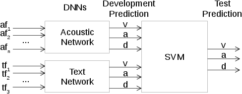

# Two-stage dimensional emotion recognition using SVM with combination of acoustic and text DNNs

by
Bagus Tris Atmaja,
Masato Akagi,
etc

> This is a repository for papers above consisting Python codes, Latex codes, and figure
> used in the paper.

This paper has been submitted for publication in *Computer Speech and Language*.

*Block diagram of main method.*

## Abstract

> Automatic speech emotion recognition (SER) by a computer is a critical component for more natural human-machine interaction. As in human-human interaction, the capability to perceive emotion correctly is essential to taking further
> steps in a particular situation. One issue in SER is whether it is necessary to
> combine acoustic features with other data such as speech, facial expressions,
> text, and motion capture. This research proposes to combine acoustic and
> text information by applying a late-fusion approach consisting of two steps.
> First, acoustic and text features are trained separately in deep learning systems. Second, the prediction results from the deep learning systems are fed
> into a support vector machine (SVM) to predict the final regression score. Furthermore, the task in this research is dimensional emotion modeling, because it
> can enable deeper analysis of affective states. Experimental results show that
> this two-stage, late-fusion approach obtains higher performance than that of
> any one-stage processing, with a linear correlation from one-stage to two-stage
> processing.

## Software implementation

> All computation methods are performed using Python version 3.6 with 
> Numpy, Scikit-learn, and Tensorflow-based Keras.

All source code used to generate the results and figures in the paper are in
the `code` folder.
The calculations and figure generation are are run using Python scripts.
The data used in this study is provided in `data` and the sources for the
manuscript text and figures are in `latex`.
Results generated by the code are saved in `fig`.
See the `README.md` files in each directory for a full description.

## Getting the code

You can download a copy of all the files in this repository by cloning the
[git](https://git-scm.com/) repository:

    git clone https://github.com/bagustris/two-state-ser

or [download a zip archive](https://github.com/bagustris/two-stage-ser/archive/master.zip).

A copy of the repository is also archived at *insert DOI here*

## Dependencies

You'll need a working Python environment to run the code.
The recommended way to set up your environment is through the
[Anaconda Python distribution](https://www.anaconda.com/download/) which
provides the `conda` package manager.
Anaconda can be installed in your user directory and does not interfere with
the system Python installation.
The required dependencies are specified in the file `environment.yml`.

We use `conda` virtual environments to manage the project dependencies in
isolation.
Thus, you can install our dependencies without causing conflicts with your
setup (even with different Python versions).

Run the following command in the repository folder (where `environment.yml`
is located) to create a separate environment and install all required
dependencies in it:

    conda env create

## Reproducing the results

Before running any code you must activate the conda environment:

    source activate ENVIRONMENT_NAME

or, if you're on Windows:

    activate ENVIRONMENT_NAME

This will enable the environment for your current terminal session.
Any subsequent commands will use software that is installed in the environment.

To build and test the software, produce all results and figures, and compile
the manuscript PDF, run this in the top level of the repository:

    make all

If all goes well, the manuscript PDF will be placed in `manuscript/output`.

You can also run individual steps in the process using the `Makefile`s from the
`code` and `manuscript` folders. See the respective `README.md` files for
instructions.

Another way of exploring the code results is to execute the Jupyter notebooks
individually.
To do this, you must first start the notebook server by going into the
repository top level and running:

    jupyter notebook

This will start the server and open your default web browser to the Jupyter
interface. In the page, go into the `code/notebooks` folder and select the
notebook that you wish to view/run.

The notebook is divided into cells (some have text while other have code).
Each cell can be executed using `Shift + Enter`.
Executing text cells does nothing and executing code cells runs the code
and produces it's output.
To execute the whole notebook, run all cells in order.

## License

All source code is made available under a BSD 3-clause license. You can freely
use and modify the code, without warranty, so long as you provide attribution
to the authors. See `LICENSE.md` for the full license text.

The manuscript text is not open source. The authors reserve the rights to the
article content, which is currently submitted for publication in the
Computer Speech and Language.
